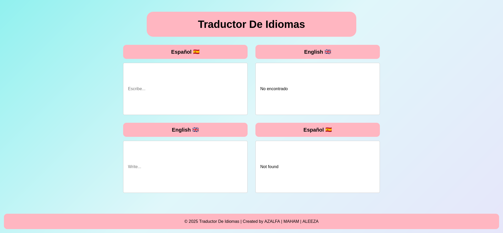
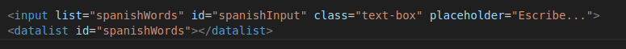
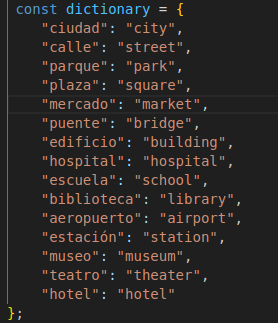
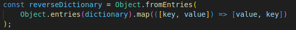
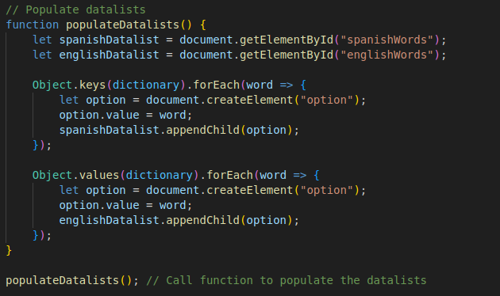
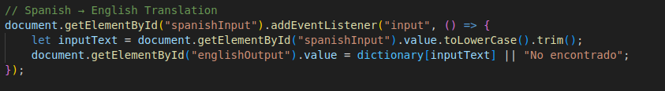
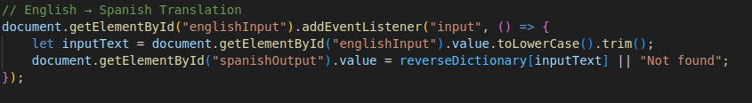

# EN ESPAÑOL

# Traductor 

## 📌 Descripción

Este proyecto es un traductor básico de español a inglés y de inglés a español. No usa ninguna API externa, sino que emplea un diccionario en JavaScript para traducir palabras automáticamente.

### 🚀 Características

✔ Traducción automática sin necesidad de botones.
✔ Sugerencias de palabras con datalist.
✔ No requiere conexión a internet.

## 📂 Estructura del Proyecto

- │── 📄 index.html # Página principal
- │── 📄 style.css # Estilos de la página
- │── 📄 main.js # Lógica de traducción
- │── 📄 README.md # Documentación del proyecto

## 🛠 Tecnologías Usadas

    HTML5 → Estructura de la página.
    CSS3 → Diseño y estilos.
    JavaScript → Lógica de traducción.

## 📜 Explicación del Código
### 1️⃣ index.html (Estructura de la Página)

Este archivo define la interfaz de usuario, que incluye:

- ## Cuatro campos de entrada (`input`)**:
    - Dos para escribir palabras en **español e inglés**.
    - Dos campos de solo lectura para mostrar la traducción.
- **Datalist**: Lista de sugerencias de palabras predefinidas.
- **Footer**: Muestra los nombres de los creadores.

- **Four input fields (`input`)**:  
  - Two for writing words in **Spanish and English**.  
  - Two read-only fields that display the translation.  
- **Datalist**: A list of predefined word suggestions.  
- **Footer**: Displays the creators' names.  

## 2️⃣ main.js (Lógica de Traducción)

### 📖 Diccionario de Traducción

Este diccionario almacena palabras clave en español y sus traducciones al inglés.

✦ Se utiliza un objeto en JavaScript para almacenar las traducciones.

## 📖 Diccionario Inverso (Inglés a Español)

Otro diccionario se genera automáticamente para la traducción inversa (inglés → español).

✦ Convierte { "ciudad": "city" } en { "city": "ciudad" }.

## 3️⃣ populateDatalists() (Añadir Sugerencias)

Esta función agrega palabras del diccionario a la lista de sugerencias (datalist).

✦ Agrega opciones con palabras en español e inglés.

## 4️⃣ Traducción en Tiempo Real

Cada vez que el usuario escribe en un campo de entrada, un evento se ejecuta para traducir el texto automáticamente.

## 📖 Español → Inglés

✦ Si la palabra está en el diccionario, aparece la traducción.
✦ Si no se encuentra, muestra "No encontrado".

## 📖 Inglés → Español

✦ Funciona de la misma manera, pero en sentido inverso.

# IN ENGLISH

# Language Translator  

## 📌 Description  
This project is a basic Spanish-to-English and English-to-Spanish translator. It does not rely on any external API but instead uses a predefined **JavaScript dictionary** to translate words automatically.  

## 🚀 Features  
✔ Automatic translation without buttons.  
✔ Word suggestions using `datalist`.  
✔ No internet connection required.  

## 📂 Project Structure  
### 📁 Language-Translator
- │── 📄 index.html # Main webpage
- │── 📄 style.css # Page styling
- │── 📄 main.js # Translation logic
- │── 📄 README.md # Project documentation

## 🛠 Technologies Used  
- **HTML5** → For page structure.  
- **CSS3** → For styling and design.  
- **JavaScript** → For translation logic.  

---

## 📜 Code Explanation  

### **1️⃣ `index.html` (Page Structure)**  
This file defines the user interface, which includes:  
- **Four input fields (`input`)**:  
  - Two for writing words in **Spanish and English**.  
  - Two read-only fields that display the translation.  
- **Datalist**: A list of predefined word suggestions.  
- **Footer**: Displays the creators' names.  

### **2️⃣ main.js (Translation Logic)**  

## 📖 Translation Dictionary
This dictionary stores key Spanish words and their English translations.

✦ A JavaScript object stores the translations.

### 📖 Reverse Dictionary (English to Spanish)

Another dictionary is automatically created for reverse translation (English → Spanish).

✦ Converts { "ciudad": "city" } into { "city": "ciudad" }.

### 3️⃣ populateDatalists() (Adding Suggestions)

This function adds dictionary words to the datalist for input fields.

✦ Adds options with Spanish and English words.

### 4️⃣ Real-time Translation

Every time the user types in an input field, an event runs that automatically translates the text.

## 📖 Spanish → English  

✦ If the word is in the dictionary, the translation appears.
✦ If not found, it shows "Not found".

## 📖 English → Spanish

✦ Works the same way but in the opposite direction.

