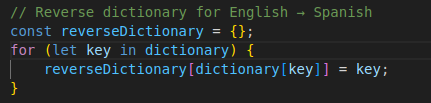
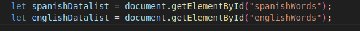
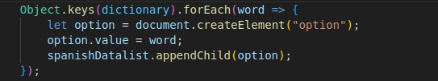
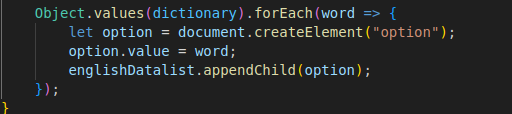
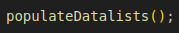

# EN ESPAÑOL

# Traductor 

## logo

This is the official logo representing the small application and project team "We 3 Coders." It symbolizes the unity, collaboration, and shared passion for coding within our group of three dedicated developers. The design captures the essence of creativity, teamwork, and innovation, serving as a visual reminder of our mission to create impactful and functional web-based projects. With a sleek and minimalistic look, the logo embodies modern aesthetics while reflecting the dynamic spirit of our coding journey.
 
## 📌 Descripción

Este proyecto es un traductor básico de español a inglés y de inglés a español. No usa ninguna API externa, sino que emplea un diccionario en JavaScript para traducir palabras automáticamente.

### 🚀 Características

✔ Traducción automática sin necesidad de botones.
✔ Sugerencias de palabras con datalist.
✔ No requiere conexión a internet.

## 📂 Estructura del Proyecto

- │── 📄 index.html # Página principal
- │── 📄 style.css # Estilos de la página
- │── 📄 main.js # Lógica de traducción
- │── 📄 README.md # Documentación del proyecto

## 🛠 Tecnologías Usadas

    HTML5 → Estructura de la página.
    CSS3 → Diseño y estilos.
    JavaScript → Lógica de traducción.

## 📜 Explicación del Código
### 1️⃣ index.html (Estructura de la Página)

Este archivo define la interfaz de usuario, que incluye:

- ## Cuatro campos de entrada (`input`)**:
    - Dos para escribir palabras en **español e inglés**.
    - Dos campos de solo lectura para mostrar la traducción.
- **Datalist**: Lista de sugerencias de palabras predefinidas.
- **Footer**: Muestra los nombres de los creadores.

## 2️⃣ main.js (Lógica de Traducción)

### 📖 Diccionario de Traducción

Este diccionario almacena palabras clave en español y sus traducciones al inglés.

✦ Se utiliza un objeto en JavaScript para almacenar las traducciones.

## 📖 Diccionario Inverso (Inglés a Español)

Otro diccionario se genera automáticamente para la traducción inversa (inglés → español).

### 📌 Puntos clave sobre el código de inversión de diccionario

- const reverseDictionary = {}; → Crea un objeto vacío para almacenar las traducciones de Inglés a Español.
- for (let key in dictionary) { ... } → Recorre cada clave (palabra en español) en el diccionario.
- reverseDictionary[dictionary[key]] = key;
- dictionary[key] obtiene la traducción en inglés de la palabra en español.
- Esta palabra en inglés se usa como clave en reverseDictionary, y la palabra original en español (key) se almacena como su valor.
- De manera efectiva, invierte el diccionario, conectando ahora palabras en inglés con palabras en español.

## 3️⃣ populateDatalists() (Agregando Sugerencias)

La función populateDatalists() agrega dinámicamente sugerencias de palabras a los campos de entrada usando diccionarios predefinidos. Esto permite a los usuarios seleccionar palabras de una lista en lugar de escribirlas manualmente.

### 📂 Explicación del Código
### 1️⃣ Obtener los Elementos Datalist

- ✦ Obtiene referencias a los elementos <datalist> donde se agregarán las sugerencias.

###  2️⃣ Agregar Palabras en Español a la Lista

- ✦ Extrae todas las palabras en español del diccionario (Object.keys(dictionary)).
- ✦ Crea un elemento <option> para cada palabra.
- ✦ Agrega las opciones al <datalist> de español.

### 3️⃣ Agregar Palabras en Inglés a la Lista

- ✦ Extrae todas las palabras en inglés del diccionario (Object.values(dictionary)).
- ✦ Crea un elemento <option> para cada palabra.
- ✦ Agrega las opciones al <datalist> de inglés.

### 4️⃣ Llamar a la Función

- ✦ Ejecuta la función para generar y mostrar las sugerencias cuando se carga la página.

- 0✦ Agrega opciones con palabras en español e inglés.

## 4️⃣ Traducción en Tiempo Real

Este código JavaScript permite la traducción en tiempo real entre español e inglés. Escucha la entrada del usuario y muestra instantáneamente la traducción correspondiente utilizando un diccionario predefinido.

## 📖 Español → Inglés

- ✦ Escucha la entrada en el campo de español (spanishInput).
- ✦ Convierte el texto a minúsculas y elimina espacios (toLowerCase().trim()).
- ✦ Busca la traducción en el objeto dictionary.
- ✦ Muestra la traducción en englishOutput o muestra "No encontrado" si la palabra no está en el diccionario.

## 📖 Inglés → Español

- ✦ Escucha la entrada en el campo de inglés (englishInput).
- ✦ Procesa el texto de la misma manera que la función en español.
- ✦ Usa reverseDictionary para encontrar el equivalente en español.
- ✦ Muestra la traducción en spanishOutput o muestra "Not found" si no está en el diccionario.

# IN ENGLISH

# Language Translator  

## 📌 Description  
This project is a basic Spanish-to-English and English-to-Spanish translator. It does not rely on any external API but instead uses a predefined **JavaScript dictionary** to translate words automatically.  

## 🚀 Features  
✔ Automatic translation without buttons.  
✔ Word suggestions using `datalist`.  
✔ No internet connection required.  

## 📂 Project Structure  
### 📁 Language-Translator
- │── 📄 index.html # Main webpage
- │── 📄 style.css # Page styling
- │── 📄 main.js # Translation logic
- │── 📄 README.md # Project documentation

## 🛠 Technologies Used  
- **HTML5** → For page structure.  
- **CSS3** → For styling and design.  
- **JavaScript** → For translation logic.  

---

## 📜 Code Explanation  

### **1️⃣ `index.html` (Page Structure)**  
This file defines the user interface, which includes:  
- **Four input fields (`input`)**:  
  - Two for writing words in **Spanish and English**.  
  - Two read-only fields that display the translation.  
- **Datalist**: A list of predefined word suggestions.  
- **Footer**: Displays the creators' names.  

### **2️⃣ main.js (Translation Logic)**  

## 📖 Translation Dictionary
This dictionary stores key Spanish words and their English translations.

✦ A JavaScript object stores the translations.

### 📖 Reverse Dictionary (English to Spanish)

Another dictionary is automatically created for reverse translation (English → Spanish).

### 📌 Key Points About the Dictionary Inversion Code

- const reverseDictionary = {}; → Creates an empty object to store the English-to-Spanish mappings.
- for (let key in dictionary) { ... } → Loops through each key (Spanish word) in the dictionary.
- reverseDictionary[dictionary[key]] = key;
- dictionary[key] retrieves the English translation of the Spanish word.
- This English word is then used as the key in reverseDictionary, and the original Spanish word (key) is stored as its value.
- Effectively, it reverses the dictionary, so English words now connected to Spanish words.

# 3️⃣ populateDatalists() (Adding Suggestions)

The populateDatalists() function dynamically adds word suggestions to the input fields using predefined dictionaries. It allows users to select words from a list instead of typing them manually.

### 📂 Code Explanation
### 1️⃣ Retrieving Datalist Elements

✦ Gets references to the <datalist> elements where suggestions will be added.

### 2️⃣ Adding Spanish Words to the List

- ✦ Extracts all Spanish words from the dictionary (Object.keys(dictionary)).
- ✦ Creates an <option> element for each word.
- ✦ Appends the options to the Spanish <datalist>.

### 3️⃣ Adding English Words to the List

✦ Extracts all English words from the dictionary (Object.values(dictionary)).
✦ Creates an <option> element for each word.
✦ Appends the options to the English <datalist>.

### 4️⃣ Calling the Function

✦ Runs the function to generate and display the suggestions when the page loads.

##  Real-time Translation

This JavaScript code enables real-time translation between Spanish and English. It listens for user input and instantly displays the corresponding translation using a predefined dictionary.

## 📖 Spanish → English  

- ✦ Listens for input on the Spanish field (spanishInput).
- ✦ Converts text to lowercase and removes spaces (toLowerCase().trim()).
- ✦ Finds the translation in the dictionary object.
✦-  Displays translation in englishOutput, or shows "No encontrado" if the word is missing.

## 📖 English → Spanish

- ✦ Listens for input on the English field (englishInput).
- ✦ Processes the text similarly to the Spanish function.
- ✦ Uses the reverseDictionary to find the Spanish equivalent.
- ✦ Displays translation in spanishOutput, or shows "Not found" if missing.

## 👥 WE 3 CODERS

- **First Programmer:** Aleeza Sajid-  [GitHub](https://github.com/Aleeza951)
- **Second Programmer:** Azalfa Murtaza - [GitHub](https://github.com/zille5)
- **Third Programmer:** Maham Sajid - [GitHub](https://github.com/mahamsajid55)

